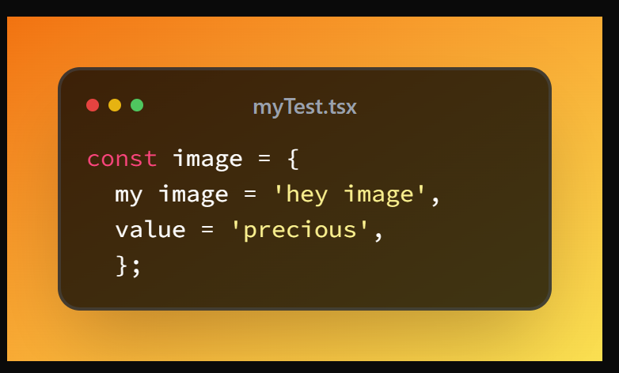
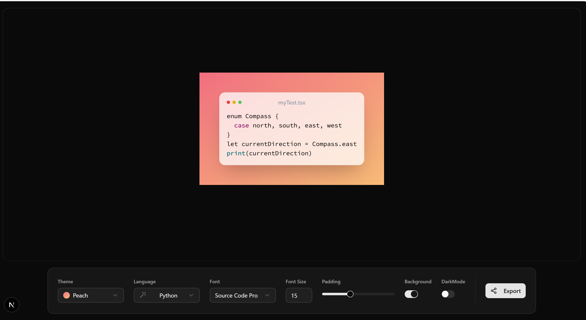

# 📸 Code-Snippets

> **Create stunning, shareable code screenshots in seconds**

A modern, feature-rich web application that transforms your code into beautiful, customizable images perfect for social media, documentation, presentations, and more.



## ✨ Features

### 🎨 **Visual Customization**
- **10+ Stunning Themes** - From vibrant gradients to professional dark modes
- **14+ Monospace Fonts** - JetBrains Mono, Fira Code, Cascadia Code, and more
- **Adjustable Styling** - Font size, padding, and background controls
- **Mac-Style Window** - Authentic macOS window chrome with traffic lights

### 🔧 **Smart Code Handling**
- **25+ Programming Languages** - JavaScript, Python, Rust, Go, Java, C++, and more
- **Auto Language Detection** - Powered by flourite for intelligent recognition
- **Syntax Highlighting** - Real-time highlighting with highlight.js
- **Live Code Editor** - Edit code directly in the browser

### 📤 **Export & Sharing**
- **Multiple Formats** - Export as PNG or SVG
- **One-Click Copy** - Copy image directly to clipboard
- **Shareable Links** - Generate URLs with embedded code and settings
- **Keyboard Shortcuts** - `Ctrl+C` to copy, `Ctrl+S` to save

### 🎯 **User Experience**
- **Resizable Canvas** - Adjust width with visual measurement guide
- **Real-time Preview** - See changes instantly as you type
- **Persistent Settings** - Your preferences are saved automatically
- **Responsive Design** - Works perfectly on desktop and mobile

## 🚀 Quick Start

### Prerequisites
- Node.js 18+ 
- npm, yarn, or pnpm

### Installation

```bash
# Clone the repository
git clone https://github.com/kaife0/code-snippets.git
cd code-snippets

# Install dependencies
npm install
# or
yarn install
# or
pnpm install

# Start development server
npm run dev
# or
yarn dev
# or
pnpm dev
```

Open [http://localhost:3000](http://localhost:3000) in your browser to see the app.

## 📸 Screenshots

### Home Interface

*Clean, intuitive interface with theme selection and customization controls*

### Application View

*Full application view showing code editor, themes, and export options*

## 🛠️ Built With

### **Core Technologies**
- [**Next.js 15**](https://nextjs.org) - React framework with App Router
- [**React 19**](https://react.dev) - Modern React with latest features
- [**TypeScript**](https://www.typescriptlang.org) - Type-safe development
- [**Tailwind CSS**](https://tailwindcss.com) - Utility-first styling

### **UI & Components**
- [**Radix UI**](https://www.radix-ui.com) - Headless component primitives
- [**shadcn/ui**](https://ui.shadcn.com) - Beautiful, accessible components
- [**Lucide Icons**](https://lucide.dev) - Consistent icon library
- [**Class Variance Authority**](https://cva.style) - Component variants

### **Code & Syntax**
- [**Highlight.js**](https://highlightjs.org) - Syntax highlighting engine
- [**React Simple Code Editor**](https://github.com/satya164/react-simple-code-editor) - Lightweight code editor
- [**Flourite**](https://github.com/ts-fs/flourite) - Language detection

### **State & Utils**
- [**Zustand**](https://github.com/pmndrs/zustand) - Simple state management
- [**HTML-to-Image**](https://github.com/bubkoo/html-to-image) - DOM to image conversion
- [**React Hot Toast**](https://react-hot-toast.com) - Toast notifications
- [**React Hotkeys Hook**](https://github.com/JohannesKlauss/react-hotkeys-hook) - Keyboard shortcuts

## 🎨 Available Themes

| Theme | Description |
|-------|-------------|
| **Hyper** | Vibrant fuchsia to orange gradient |
| **Oceanic** | Cool blue to purple ocean vibes |
| **Candy** | Sweet pink to indigo gradient |
| **Sublime** | Rose to fuchsia professional look |
| **Horizon** | Warm orange to yellow sunset |
| **Coral** | Fresh blue to emerald gradient |
| **Peach** | Soft rose to orange warmth |
| **Flamingo** | Bold pink monochrome |
| **Gotham** | Dark professional gray to black |
| **Ice** | Light rose to teal minimalism |

## 🔤 Supported Languages

JavaScript, TypeScript, Python, Java, C, C++, C#, Go, Rust, Swift, Kotlin, PHP, Ruby, Scala, Elixir, Haskell, Clojure, HTML, CSS, SCSS, SQL, JSON, YAML, TOML, Markdown, Bash, PowerShell, and more!

## ⌨️ Keyboard Shortcuts

| Shortcut | Action |
|----------|--------|
| `Ctrl+C` | Copy image to clipboard |
| `Shift+Ctrl+C` | Copy shareable link |
| `Ctrl+S` | Save as PNG |
| `Shift+Ctrl+S` | Save as SVG |

## 📁 Project Structure

```
code-snippets/
├── app/                    # Next.js App Router
│   ├── layout.tsx         # Root layout
│   ├── page.tsx           # Main application
│   └── globals.css        # Global styles
├── components/
│   ├── CodeEditor.tsx     # Main editor component
│   ├── WidthMeasurement.tsx
│   ├── controls/          # UI controls
│   │   ├── ThemeSelect.tsx
│   │   ├── LanguageSelect.tsx
│   │   ├── FontSelect.tsx
│   │   ├── FontSizeInput.tsx
│   │   ├── PaddingSlider.tsx
│   │   ├── BackgroundSwitch.tsx
│   │   ├── DarkModeSwitch.tsx
│   │   └── ExportOptions.tsx
│   └── ui/                # Reusable UI components
├── store/
│   └── use-preferences-store.ts # Zustand store
├── lib/
│   └── utils.ts           # Utility functions
└── options.ts             # App configuration
```

## 🔧 Development

### Available Scripts

```bash
# Development server with Turbopack
npm run dev

# Production build
npm run build

# Start production server
npm run start

# Lint code
npm run lint
```

### Configuration Files

- **`next.config.ts`** - Next.js configuration
- **`tailwind.config.js`** - Tailwind CSS configuration
- **`tsconfig.json`** - TypeScript configuration
- **`eslint.config.mjs`** - ESLint configuration
- **`prettier.config.js`** - Prettier configuration

## 🎯 Usage Examples

### Basic Usage
1. **Paste your code** into the editor
2. **Select a theme** from the dropdown
3. **Choose your font** and adjust size
4. **Customize padding** and background
5. **Export** as PNG/SVG or copy to clipboard

### Sharing Code
1. **Configure your settings** as desired
2. **Click "Copy Link"** to generate a shareable URL
3. **Share the link** - recipients see your exact configuration

### Keyboard Workflow
1. **Paste code** with `Ctrl+V`
2. **Copy image** with `Ctrl+C`
3. **Save file** with `Ctrl+S`

## 🚀 Deployment

### Vercel (Recommended)
```bash
# Deploy to Vercel
npm i -g vercel
vercel
```

### Netlify
```bash
# Build for static export
npm run build
# Deploy dist folder to Netlify
```

### Docker
```dockerfile
FROM node:18-alpine
WORKDIR /app
COPY package*.json ./
RUN npm ci --only=production
COPY . .
RUN npm run build
EXPOSE 3000
CMD ["npm", "start"]
```

## 🤝 Contributing

Contributions are welcome! Please feel free to submit a Pull Request.

### Development Setup
1. Fork the repository
2. Create your feature branch (`git checkout -b feature/AmazingFeature`)
3. Commit your changes (`git commit -m 'Add some AmazingFeature'`)
4. Push to the branch (`git push origin feature/AmazingFeature`)
5. Open a Pull Request

### Code Style
- Use TypeScript for type safety
- Follow ESLint and Prettier configurations
- Write meaningful commit messages
- Add comments for complex logic


## 🙏 Acknowledgments

- [shadcn](https://twitter.com/shadcn) for the amazing UI components
- [Radix UI](https://www.radix-ui.com) for accessible primitives
- [Vercel](https://vercel.com) for hosting and deployment
- [Highlight.js](https://highlightjs.org) community for syntax highlighting

## 📊 Stats


---

<div align="center">
  <strong>Made with ❤️ for developers who love beautiful code</strong>
</div>
